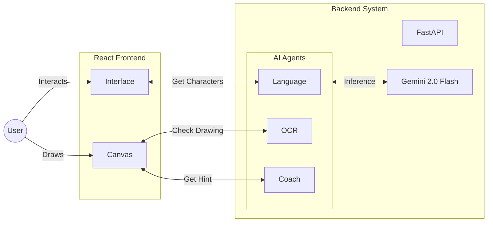

# Chalk - Multi-Agent Handwriting Practice App

**Track**: Agents for Good (Education)

## 📖 Problem
Learning a new script (like Hindi, Nepali, or even English cursive) is challenging without immediate feedback. Traditional methods rely on tracing books which cannot correct mistakes or provide personalized guidance. Personal tutors are expensive and not scalable.

## 💡 Solution
**Chalk** is an AI-powered handwriting practice application that acts as a personal tutor. It uses a multi-agent system to:
1.  **Teach**: Provide the correct character set for any language.
2.  **Evaluate**: Use computer vision to analyze user handwriting in real-time.
3.  **Coach**: (Planned) Provide personalized hints based on mistakes.

## 🏗️ Architecture

The application uses a **FastAPI** backend with **Google's Agent Development Kit (ADK)** and a **React** frontend.



### Agents
- **Language Agent**: Retrieves the alphabet and digits for a selected language.
- **OCR Agent**: Uses Gemini 1.5 Flash (Vision) to compare the user's drawing with the expected character, providing confidence scores and specific feedback.
- **Coach Agent**: Analyzes the user's drawing to provide encouraging hints and specific improvement tips without revealing the answer.

## 🚀 Setup

### Backend
1.  Navigate to `backend`:
    ```bash
    cd backend
    ```
2.  Create and activate virtual environment:
    ```bash
    python -m venv venv
    source venv/bin/activate
    ```
3.  Install dependencies:
    ```bash
    pip install -r requirements.txt
    ```
4.  Run the server:
    ```bash
    uvicorn main:app --reload
    ```

### Frontend
1.  Navigate to `frontend`:
    ```bash
    cd frontend
    ```
2.  Install dependencies:
    ```bash
    npm install
    ```
3.  Run the development server:
    ```bash
    npm run dev
    ```

### Docker (Bonus)
1.  Build the image:
    ```bash
    docker build -t chalk-app .
    ```
2.  Run the container:
    ```bash
    docker run -p 8000:8000 chalk-app
    ```
    Access the app at `http://localhost:8000`.

## 🛠️ Tech Stack
- **Backend**: Python, FastAPI, Google ADK, Gemini 2.5 Flash
- **Frontend**: React, Vite, HTML5 Canvas
